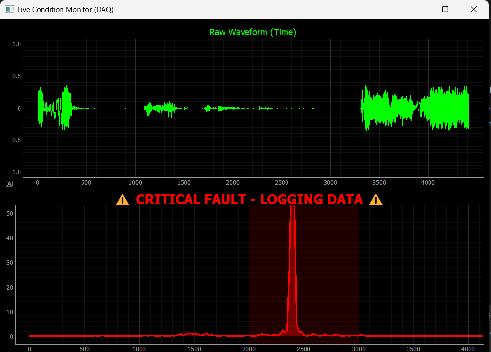

# Industrial Acoustic Twin: Real-Time Condition Monitoring System

### 🔴 Live DAQ | 📊 FFT Signal Processing | 🚨 Event-Triggered Logging

**A Python-based Digital Twin that simulates industrial predictive maintenance. It uses audio spectral analysis to detect mechanical fault signatures and triggers automated "Black Box" data logging.**


*(Above: The system detecting a high-frequency anomaly (simulated bearing fault) in the 2kHz-3kHz range, triggering the Red Alarm state and dumping the data buffer to disk.)*

---

## 📖 Overview
In industries like **Aviation** and **Formula 1**, we cannot rely on human eyes to catch fast-moving failures. We need automated systems that monitor physics.

This project builds a full **Signal Chain (DAQ → Processing → Visualization)** to monitor acoustic vibrations. It continuously analyzes the frequency spectrum and uses a **Circular Buffer** to capture "Pre-Trigger" data—saving the 5 seconds of history *leading up to* a crash, acting as a Flight Data Recorder (FDR).

## 🛠 Tech Stack
* **Language:** Python 3.10+
* **DAQ:** `sounddevice` (44.1kHz real-time sampling)
* **Signal Processing:** `NumPy` & `SciPy` (FFT, Hanning Window, Circular Buffering)
* **Visualization:** `PyQtGraph` (High-performance plotting for >30 FPS updates)
* **GUI:** `PyQt5`

## ⚙️ How It Works
1.  **The Sensor:** Uses the computer microphone to sample audio at 44,100 Hz.
2.  **The Math:** Applies a **Hanning Window** to the raw signal (to reduce spectral leakage) and performs a **Fast Fourier Transform (FFT)** to convert Time-Domain data into Frequency-Domain spikes.
3.  **The Logic:** Monitors a specific "Danger Zone" (2000Hz - 3000Hz).
    * *Normal Operation:* Background is Green/Black.
    * *Fault Detected:* If magnitude > Threshold, the system triggers a **CRITICAL ALARM**.
4.  **The Black Box:** Upon alarm, the system dumps the in-memory circular buffer to a `.wav` file, capturing the exact moment of failure for post-mortem analysis.

## 🚀 How to Run
1.  **Clone the repository:**
    ```bash
    git clone [https://github.com/YOUR_USERNAME/Industrial-Acoustic-Twin.git](https://github.com/YOUR_USERNAME/Industrial-Acoustic-Twin.git)
    cd Industrial-Acoustic-Twin
    ```

2.  **Install dependencies:**
    ```bash
    pip install -r requirements.txt
    ```

3.  **Run the System Controller:**
    ```bash
    python main.py
    ```
    * Select **"Start Live Monitor"** to begin data acquisition.
    * Whistle or generate a high-pitch tone to trigger the alarm.
    * Select **"Launch Replay Tool"** to analyze the saved crash logs.

## 📂 Project Structure
* `main.py` - The central launcher application (System Controller).
* `live_monitor.py` - The Production System. Handles DAQ, FFT, and Alarm Logic.
* `replay_tool.py` - The Forensics Tool. Replays crash logs frame-by-frame.
* `logs/` - Directory where "Black Box" recordings are automatically saved.

## 🧠 Engineering Concepts Demonstrated
* **Circular Buffering:** Efficient memory management for pre-trigger data capture.
* **Digital Signal Processing (DSP):** Real-time FFT implementation and Windowing functions.
* **Event-Driven Architecture:** Asynchronous data logging triggered by sensor thresholds.
* **Modularity:** Separation of "Production" (Live) and "Analysis" (Replay) tools.

---
*Built as a prototype for Industrial IoT and Telemetry systems.*
